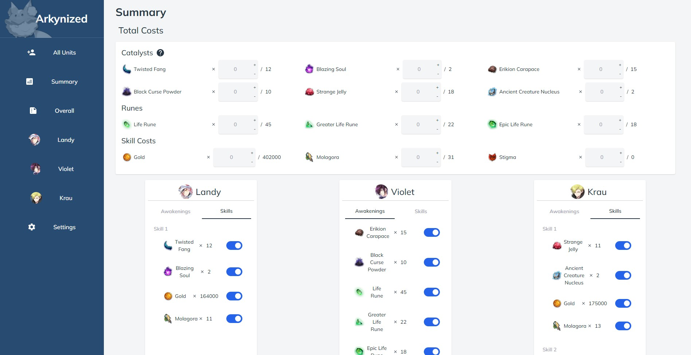
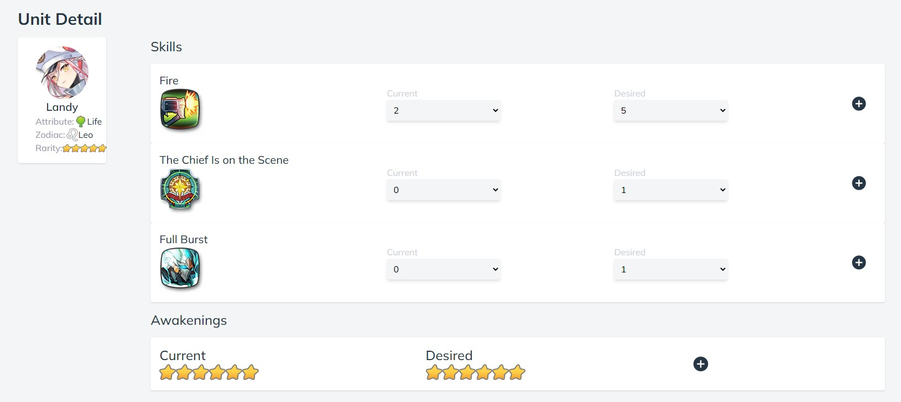
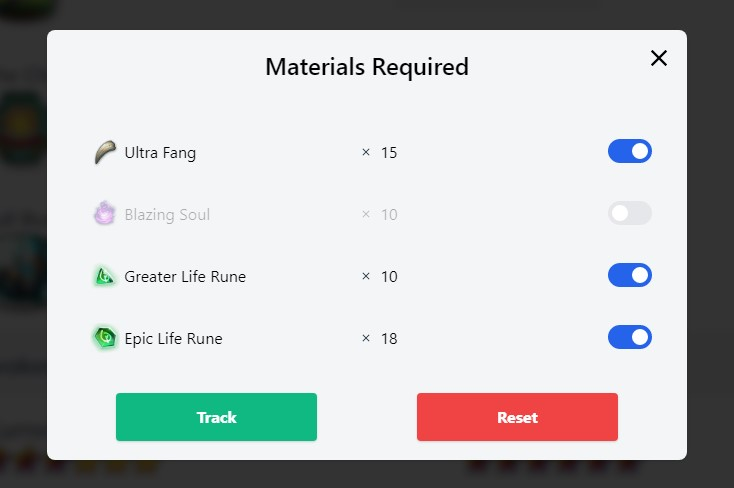
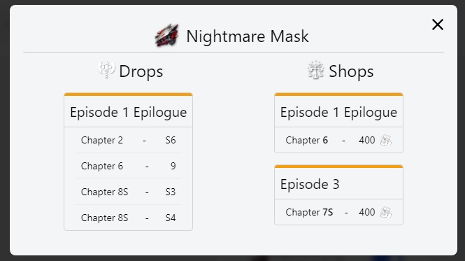
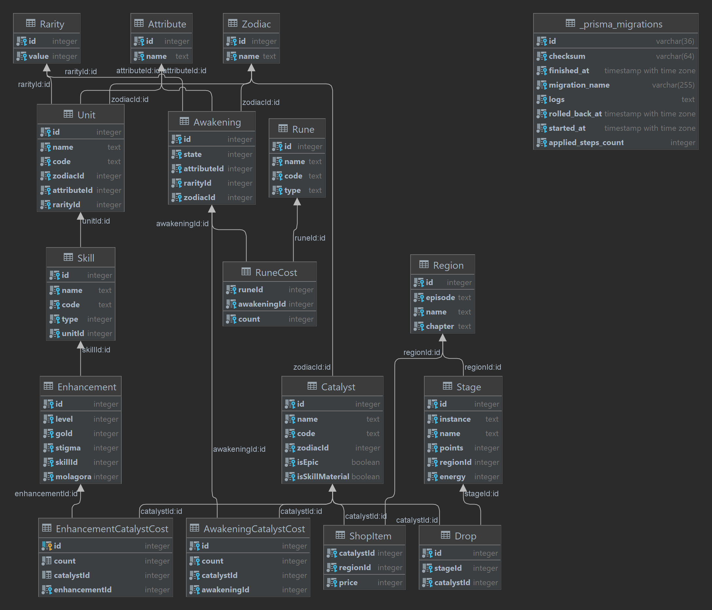

<h1 align="center">Arkynized</h1>

<h2 align="center"><a href="https://arkynized.herokuapp.com">Live Project</a></h2>

# Description

This web app was designed to help Epic Seven users organize <i>(arky-nize)</i> their resources for their unit upgrades.

# Game Context
* Units can be upgraded in three ways:
    1. Leveling
        * All units are able to level up to level 60. 
    2. **Awakening**
        * At every 10 levels these units "unlock" an awakening node that allows them to further upgrade their stats at the cost of resources.
            * *Awakening Resources: Catalysts, Runes*
    3. **Skill Upgrades**
        * Each unit has three skills at their disposal. Each of these skills can be upgraded to a certain level at the cost of resources.
            * *Skill Resources: Catalysts, Gold, Stigma/Molagora (This depends on a unit's rarity)*

# Arkynize Features
## All Units
* This page allows the user to view all the available units and search for ones they would like to track resources for.

## Unit Detail
* The user is taken to a unit's detail page once they click on a particular unit.
* They are then able to select their current upgrade progress along with their goal upgrade in order to calculate and track the resources required.

### Awakening/Skill Enhancement Cost
* After selecting their current/goal levels the user is prompted with a page that includes the resources required and allows them to select which resources they would like to track.

## Summary
* The user can see all the units they've tracked as well a total count for the resources required to accomplish their goals. 
* From the total costs component the user can enter the total number of a certain resource they currently own and update as they acquire more.
* They can toggle individual costs from this page as well.

### Catalyst Details
* The user can click on catalysts to learn more information about where they can be "farmed" or purchased.
* There are two ways to acquire catalysts. 
    1. They can be farmed from specific stages with a low percentage rate. 
    2. When a player farms a stage from a specific "region" they earn points that be used towards that region's shops. Catalysts can be purchased from these shops.

## Settings
* The tracking information is all stored locally on the client's browser using Local Storage.
* The user is able to export/import their data if they'd like to follow their progress on other devices.

## Technology
* GraphQL, Typescript, React, Redux, LocalStorage, Apollo Server+Client, PostgreSQL
* Maybe include a data visualization for database table
* Database models: 

# Credit
* <a href="https://www.norbdragon.com/uploads/epic7/datamine/index.html">Norbdragon's Datamining</a>
    * For datamining recent image assets
* <a href="https://github.com/EpicSevenDB/api">EpicSevenDB's API</a>
    * For providing assets and data for most units